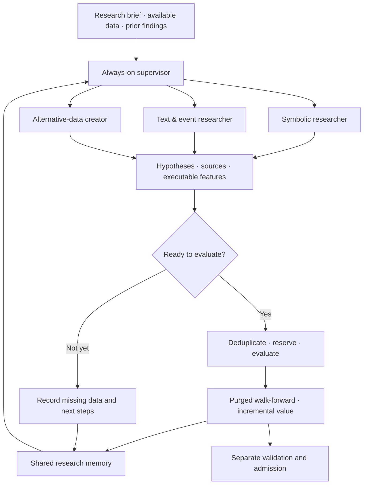

<div align="center">

# Honest Alpha Lab

### Let agents explore. Make the evidence earn its place.

An always-on research lab for discovering, testing and remembering equity signals.

[](pyproject.toml)
[](docs/implementation-status.md)
[](docs/money-safety-review.md)
[](docs/books-and-control-room.md)

[Get started](#get-started) · [How it works](#how-it-works) · [Onboarding](docs/onboarding.md) · [Research library](research-vault/literature/index.md) · [Contribute](CONTRIBUTING.md)

</div>

---

**Ideas are cheap. Evidence is the product.**

What if a research team could work around the clock—reading filings, discovering
unexpected datasets, writing experiments and testing new signals—while remembering
what it had already tried?

Honest Alpha Lab is building that team.

Researchers have room to explore. Numerical services evaluate their proposals.
A shared memory connects sources, hypotheses, experiments and failures. The
objective is **incremental, persistent information**, not a beautiful backtest.

> **Research preview.** The recurring supervisor and major research components are
> implemented. Production deployment, hard model-spend controls, complete validation
> integration and multi-day reliability testing remain unfinished. No profitable
> alpha or investment performance is claimed.

**Upgrading an existing lab?** Read the [money-safety fixes and migration guide](docs/money-safety-review.md)
before resuming. Numerical snapshots now require explicit execution clocks;
CLI-agent launches require an explicit acknowledgement of unmetered provider
billing risk. Preserve old artifacts and rerun affected research.

## Three ways to discover something useful

| Researcher | What it explores | Example question |
| :--- | :--- | :--- |
| **Symbolic factors** | Numerical market and fundamental relationships | Does an accounting change matter more when the market barely reacts? |
| **Text & events** | Filings, disclosures, releases and timestamped news | Did the company's operating language change before its reported results? |
| **Alternative data** | New datasets, economic proxies and company exposures | Could weather, freight or energy observations reveal something public financial fields miss? |

The alternative-data path includes a **dataset-creation agent**. Its job is to find
sources, collect observations, prototype features and map them to assets—not just
invent a story about a dataset someone else might build.

These are research directions, not verified strategies.

## How it works



### Always-on service. Finite experiments.

The supervisor continually schedules campaigns, leases work, records outcomes
and refills the queue. It survives idle periods and waits through exhausted daily
dispatch allowances. Each job still has a deadline, retry limit and stable identity.

Completed work can be recovered without silently paying for the same invocation
again. A worker watchdog can end a job even if its supervisor crashes. Current
coordination is **single-host**; deployment and multi-day certification are still
work in progress.

### Freedom in research. Discipline at the handoff.

Agents get writable, network-enabled research workspaces. They can follow new
sources, write collectors, run code and save arbitrary file formats. A predefined
catalog is a starting point, not the edge of their world.

Structured contracts apply when an idea becomes a reproducible feature or enters
numerical evaluation. Discovery-only findings do **not** require pre-approved
lineage. Collected data does **not** automatically become accepted evidence.

### A shared brain that remembers the misses

Linked Markdown and JSON make research readable in Obsidian and usable by agents.
Campaigns also share recent findings and can receive measured development feedback.

The system records what was tried, which data are missing and whether a formula
duplicates existing work. Current retrieval uses bounded recent context; a deeper
semantic research graph is on the roadmap.

## The honest part

A system that can generate thousands of hypotheses can also generate thousands of
opportunities to fool itself.

Our design keeps these distinctions explicit:

- **A collected dataset is not a point-in-time dataset.** Preserve versions,
  publication times and extraction clocks.
- **A new formula is not necessarily new information.** Compare against a fixed
  library, including numerical similarity.
- **An evaluated candidate is not an accepted alpha.** Admission is separate from
  the agent that proposed it.
- **A modern LLM reading old text is not a historical prediction.** Retrospective
  replay is explicitly labeled.
- **A passing software test is not a profitable backtest.** Fixtures test code;
  genuine historical data must test financial claims.
- **A sealed test is not another feedback channel.** Its outcomes stay out of
  the research loop.

**Live execution disabled by default. No LLM fine-tuning. No agent self-approval.**
An optional Webull HK adapter now has separately armed sandbox/production routes.
No real orders were placed during development; this is not live-readiness certification.

## What actually runs today

| Capability | Status |
| :--- | :--- |
| Recurring campaigns, durable claims, retries and pause/resume | Implemented |
| Codex research workspaces and a provider-neutral CLI seam | Implemented; other providers need compatible adapters |
| Event/proxy → stock-level feature materialization | Implemented |
| Content-verified Parquet snapshots and a bounded formula DSL | Implemented |
| Purged comparisons with ridge, elastic net and LightGBM | Implemented |
| PostgreSQL numerical queue and measured development feedback | Implemented |
| Gaussian HMM / non-Markov state analysis | Integrated into numerical reports and research feedback; fold-local diagnostics |
| Conventional allocation and daily research backtesting | Integrated signal handoff, three allocation comparisons, audited artifacts and recurring jobs |
| Signal-to-strategy agent | CLI blueprints compiled into causal daily combinations and conventional backtests |
| Flexible session books | Historical close-to-next-open replay with intraday prices and explicit exchange calendars |
| Persistent paper books | Daily historical and forward shadow ingestion; normalized feed supplied by caller |
| Private trade control room | Book policies, approval inbox and separately armed Webull US limit-order adapter; not deployed |
| Provider-based hard model-spend enforcement | **Not complete** |
| End-to-end real-data search benchmarks and full admission | **Not complete** |
| Deployed, multi-day-certified 24/7 operation | **Not complete** |

See the [implementation audit](docs/implementation-status.md) for the longer version.

[State analysis → portfolio workflow](docs/state-and-portfolio-workflow.md) connects
numerical predictions to dated execution inputs, explicit costs and reproducible
portfolio reports. Missing state data are reported explicitly. These integrations
do not certify a profitable strategy or replace independent data validation.

[Signals → strategies → books → control room](docs/books-and-control-room.md)
documents session timing, paper ledgers, private Tailscale hosting and the exact
boundaries of the optional live adapter. Exact live auction scheduling and
account-wide reconciliation/risk remain unfinished.

### A real run, not a mock dashboard

One actual Codex researcher ran through the supervisor, chose an official NOAA
source, downloaded **30,328 bytes**, parsed **918 monthly observations**, and saved
its code, provenance and a tentative utility-demand hypothesis.

The source hash and row count were independently checked. **No stock-return
backtest was performed.**

The run also exposed a useful failure: the agent reported zero tokens while the
provider log recorded substantial usage. That discrepancy is documented, not
hidden behind an “autonomous” badge.

[Read the smoke-test report →](research/supervisor-live-smoke-2026-09-05.md)

The **536-test local checkpoint** covers software behavior, including real
PostgreSQL and subprocess tests. It is not a financial-performance benchmark.

## Get started

### 1. Install

```sh
git clone https://github.com/ferdinandl007/honest-alpha-lab.git
cd honest-alpha-lab

python3.12 -m venv .venv
source .venv/bin/activate
python -m pip install -e '.[analytics,models,storage,dev]'
python -m honest_alpha_lab --help
```

Researcher jobs need an installed, authenticated Codex CLI. Numerical queue jobs
also need PostgreSQL and separately provisioned service roles. No market-data
subscription, historical dataset or API credential is bundled.

### 2. Inspect the campaigns before running them

`config/supervisor.example.json` contains three recurring discovery campaigns.
Review their briefs, timeouts and daily dispatch limits.

> Starting the service consumes your configured model account's usage.
> Dispatch limits are implemented; **a declared token allowance is not yet a
> guaranteed spending cap**. Do not leave paid research unattended on that assumption.

### 3. Start the supervisor

```sh
python -m honest_alpha_lab supervise \
  --config config/supervisor.example.json \
  --state var/supervisor/state.sqlite \
  --work-root var/supervisor/work
```

In another terminal:

```sh
python -m honest_alpha_lab supervisor-status \
  --state var/supervisor/state.sqlite
```

Stop with `Ctrl+C`. Restart with the same state and work roots to preserve history.
This starts a foreground service; it does not install boot-time startup.

The example explores sources and records findings. To evaluate alphas, connect a
real historical snapshot and a locked numerical run.

[Always-on service guide →](docs/always-on-service.md)

## Bring data, not just tickers

The historical evaluator expects three Parquet tables:

| Input | Required columns |
| :--- | :--- |
| Observations | `session`, `asset`, `field`, `value`, `available_at`, `source_row_id` |
| Historical universe | `asset`, `valid_from`, `valid_to`, `known_at` |
| Exchange calendar | `session`, `decision_at` |

Supply stable security identities, the required total-return series, proposed
feature fields and an explicit provenance declaration. Historical membership,
corporate actions and delisting coverage matter.

No approved historical equity benchmark dataset is included in this repository.

[Exact inputs and first-run checklist →](docs/onboarding.md#4-exactly-what-are-the-inputs)

## Built for research, not one model

**Python 3.12** · **Parquet + DuckDB** · **PostgreSQL** · **scikit-learn** ·
**LightGBM** · **hmmlearn** · **content-addressed artifacts** · **Markdown + JSON memory**

Conventional models do the numerical work. CLI researchers propose and implement
experiments. Qlib-compatible interfaces and adapters are a design direction—not
a claim that the entire Qlib ecosystem is already integrated.

## Where to go next

| If you want to… | Start here |
| :--- | :--- |
| Understand the whole system | [Onboarding](docs/onboarding.md) |
| Run recurring research | [Always-on service](docs/always-on-service.md) |
| Configure researcher freedom | [Research workspaces](docs/research-workspaces.md) |
| Test a numerical signal | [Numerical workflow](docs/numerical-workflow.md) |
| Build event or proxy features | [Feature handoff](docs/event-proxy-features.md) |
| Set up durable numerical workers | [PostgreSQL setup](docs/postgres-store.md) |
| Understand the evidence behind the design | [Literature review](research/automated-alpha-literature-2026-09-04.md) |
| Help build it | [Contributing](CONTRIBUTING.md) |

## The next milestones

- [ ] Hard, provider-based spending controls.
- [ ] Deployment, health alerts and multi-day recovery drills.
- [ ] Continuous data refresh and numerical-run renewal.
- [ ] Better search planning and retrieval of useful failures.
- [ ] Fully connected robustness, cost and admission checks.
- [ ] Matched-budget, real-data benchmarks across research methods.

If you care about **agents that do research and leave an inspectable trail**,
there is room to help. Bring a dataset adapter, a difficult failure case, a
reproducible experiment—or a result that disproves a promising idea.

---

<div align="center">

**More hypotheses. Better evidence. A memory of both.**

Built in public by [@ferdinandl007](https://github.com/ferdinandl007).

<sub>Research software. Not investment advice. No return guarantees. Data and model access remain subject to their respective terms.</sub>

</div>
